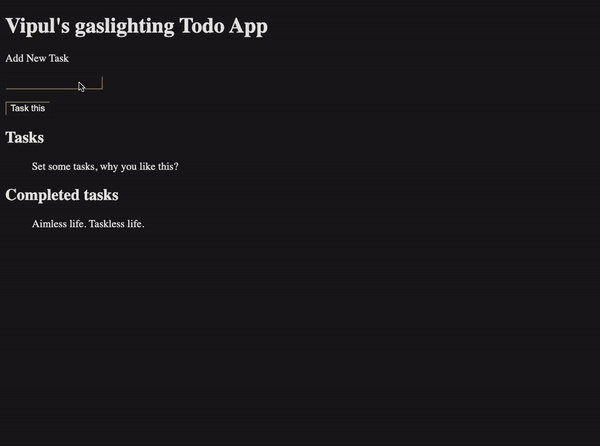

# Yet another Todo app that no one would use

But, with elements of gaslighting, so you finish your tasks. Built under an hour, using vanilla ReactJS. 

Hydrating my ReactJS skills with a simple Todo app just like React does when it sees static HTML. 

Lessons Re-learned: 

1. React workflows
2. Managing State
3. Handling events 
4. Pages, Components, Props, Children.
5. Hooks
6. Using React Developer Tools to figure out states and events.

Docs:
 
1. https://react.dev
2. https://www.youtube.com/watch?v=Rh3tobg7hEo 
